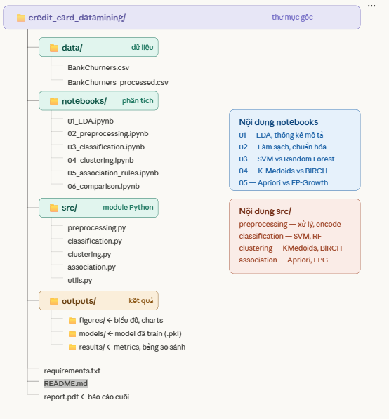

# 🏦 Credit Card Customer Churn — Khai Phá Dữ Liệu

> Đồ án môn **Khai Phá Dữ Liệu** — So sánh hiệu quả các thuật toán Phân lớp, Phân cụm và Khai phá Luật Kết hợp trên bộ dữ liệu khách hàng thẻ tín dụng ngân hàng.

---

## 📌 Mô tả đề tài

Dự án phân tích hành vi **10.127 khách hàng** thẻ tín dụng của một ngân hàng Mỹ với mục tiêu:

- **Phân lớp:** Dự đoán khách hàng có rời bỏ dịch vụ không (`Attrition_Flag`)
- **Phân cụm:** Gom nhóm khách hàng theo đặc điểm tài chính và hành vi giao dịch
- **Luật kết hợp:** Khai phá các mối quan hệ ẩn giữa các đặc trưng của khách hàng

Mỗi nhóm sử dụng **2 thuật toán** để so sánh hiệu quả theo 4 tiêu chí: Độ chính xác, Tốc độ xử lý, Khả năng giải thích và Trực quan hóa kết quả.

---

## 📊 Dataset

| Thuộc tính | Giá trị |
|---|---|
| Nguồn | [Kaggle — Credit Card Customers](https://www.kaggle.com/datasets/sakshigoyal7/credit-card-customers) |
| Số bản ghi | 10.127 khách hàng |
| Số thuộc tính | 23 cột (21 features + 1 nhãn + 1 ID) |
| Nhãn phân lớp | `Attrition_Flag` (Existing / Attrited Customer) |
| Tỉ lệ churn | ~16% (mất cân bằng lớp) |

### Các thuộc tính chính

| Nhóm | Thuộc tính |
|---|---|
| Nhân khẩu học | `Customer_Age`, `Gender`, `Dependent_count`, `Education_Level`, `Marital_Status`, `Income_Category` |
| Thông tin tài khoản | `Card_Category`, `Months_on_book`, `Total_Relationship_Count` |
| Hành vi giao dịch | `Total_Trans_Amt`, `Total_Trans_Ct`, `Total_Revolving_Bal`, `Avg_Utilization_Ratio` |
| Tương tác ngân hàng | `Months_Inactive_12_mon`, `Contacts_Count_12_mon`, `Credit_Limit` |

---

## 🗂️ Cấu trúc thư mục



```
credit_card_datamining/
│
├── 📁 data/                        # Dữ liệu thô và đã xử lý
│   ├── BankChurners.csv            # Dataset gốc từ Kaggle
│   └── BankChurners_processed.csv  # Sau tiền xử lý
│
├── 📁 notebooks/                   # Jupyter Notebooks phân tích chính
│   ├── 01_EDA.ipynb                # Khám phá và thống kê mô tả
│   ├── 02_preprocessing.ipynb      # Làm sạch, encoding, chuẩn hóa
│   ├── 03_classification.ipynb     # SVM vs Random Forest
│   ├── 04_clustering.ipynb         # K-Medoids vs BIRCH
│   ├── 05_association_rules.ipynb  # Apriori vs FP-Growth
│   └── 06_comparison.ipynb         # So sánh tổng hợp 6 thuật toán
│
├── 📁 src/                         # Module Python tái sử dụng
│   ├── preprocessing.py            # Hàm làm sạch và biến đổi dữ liệu
│   ├── classification.py           # Wrapper SVM, Random Forest
│   ├── clustering.py               # Wrapper K-Medoids, BIRCH
│   ├── association.py              # Wrapper Apriori, FP-Growth
│   └── utils.py                    # Hàm vẽ biểu đồ, đánh giá chung
│
├── 📁 outputs/                     # Kết quả đầu ra
│   ├── figures/                    # Biểu đồ, confusion matrix, scatter plot
│   ├── models/                     # Model đã train (.pkl)
│   └── results/                    # Bảng metrics (CSV)
│
├── 📁 reports/                     ★ Diễn giải ý nghĩa kết quả
│   ├── classification_report.md    # Phân tích SVM vs Random Forest
│   ├── clustering_report.md        # Phân tích K-Medoids vs BIRCH
│   ├── association_report.md       # Phân tích Apriori vs FP-Growth
│   └── final_comparison.md         # Tổng hợp và nhận xét cả 3 nhóm
│
├── 📁 interpretation/              ★ Phân tích sâu và giải thích model
│   ├── cluster_profiling.ipynb     # Mô tả đặc trưng từng cụm
│   ├── rules_analysis.ipynb        # Lọc và diễn giải luật có ý nghĩa
│   └── feature_importance.ipynb    # SHAP values, giải thích quyết định
│
├── requirements.txt                # Danh sách thư viện cần cài
└── README.md                       # File này
```

---

## 🤖 Thuật toán sử dụng

### Nhóm 1 — Phân lớp (Classification)

| Thuật toán | Mục tiêu so sánh |
|---|---|
| **SVM** (kernel RBF) | Độ chính xác cao, xử lý ranh giới phi tuyến |
| **Random Forest** | Tốc độ nhanh hơn, giải thích được feature importance |

**Bài toán:** Dự đoán `Attrition_Flag` — khách hàng có rời bỏ hay không.  
**Metrics:** Accuracy, F1-Score, Precision, Recall, ROC-AUC, Confusion Matrix.

### Nhóm 2 — Phân cụm (Clustering)

| Thuật toán | Mục tiêu so sánh |
|---|---|
| **K-Medoids (PAM)** | Kháng outlier tốt, medoid là khách hàng thực |
| **BIRCH** | Tốc độ O(n), phù hợp dữ liệu lớn |

**Bài toán:** Gom nhóm khách hàng theo hành vi tài chính (bỏ cột nhãn).  
**Metrics:** Silhouette Score, Davies-Bouldin Index, thời gian chạy.

### Nhóm 3 — Luật kết hợp (Association Rules)

| Thuật toán | Mục tiêu so sánh |
|---|---|
| **Apriori** | Chuẩn, dễ hiểu, nhiều lần quét dữ liệu |
| **FP-Growth** | Nhanh hơn 2–10x nhờ FP-tree, ít quét hơn |

**Bài toán:** Khai phá luật dạng *"Nếu Income_thấp ∧ Card_Blue → Churn_cao"*.  
**Metrics:** Support, Confidence, Lift, thời gian thực thi.

---

## ⭐ Điểm khác biệt: Diễn giải ý nghĩa kết quả

Ngoài việc chạy thuật toán và so sánh metrics, dự án tập trung vào **giải thích ý nghĩa thực tiễn**:

- **`reports/`** — Mỗi nhóm thuật toán có một file markdown riêng phân tích bằng ngôn ngữ kinh doanh, không chỉ in số.
- **`cluster_profiling.ipynb`** — Đặt tên và mô tả từng cụm khách hàng (ví dụ: *"Nhóm nguy cơ cao: ít giao dịch, lâu không hoạt động"*).
- **`rules_analysis.ipynb`** — Lọc luật có lift > 2 và giải thích ý nghĩa với bộ phận kinh doanh.
- **`feature_importance.ipynb`** — Dùng SHAP values để giải thích tại sao model dự đoán một khách hàng cụ thể sẽ churn.

---

## ⚙️ Cài đặt & Chạy

### 1. Clone project

```bash
git clone https://github.com/your-username/credit_card_datamining.git
cd credit_card_datamining
```

### 2. Cài thư viện

```bash
pip install -r requirements.txt
```

### 3. Tải dataset

Tải `BankChurners.csv` từ [Kaggle](https://www.kaggle.com/datasets/sakshigoyal7/credit-card-customers) và đặt vào thư mục `data/`.

> ⚠️ **Quan trọng:** Drop 2 cột cuối trước khi dùng:
> ```python
> df.drop(columns=[col for col in df.columns if col.startswith('Naive_Bayes')], inplace=True)
> ```

### 4. Chạy theo thứ tự

```bash
# Chạy tuần tự từ EDA đến so sánh
jupyter notebook notebooks/01_EDA.ipynb
jupyter notebook notebooks/02_preprocessing.ipynb
# ... tiếp tục đến 06
```

---

## 📦 Thư viện chính

```
pandas, numpy, scikit-learn
scikit-learn-extra       # K-Medoids
mlxtend                  # Apriori, FP-Growth, Association Rules
matplotlib, seaborn      # Visualization
shap                     # Model explanation
jupyter                  # Notebook
```

---

## 👤 Tác giả

| | |
|---|---|
| **Sinh viên** | Đặng Ngọc Nhân |
| **MSSV** | 23110279 |
| **Sinh viên** | Huỳnh Tấn Vinh |
| **MSSV** | 23110365 |
| **Môn** | Khai Phá Dữ Liệu |
| **Giảng viên** | Th.S Trần Trọng Bình |